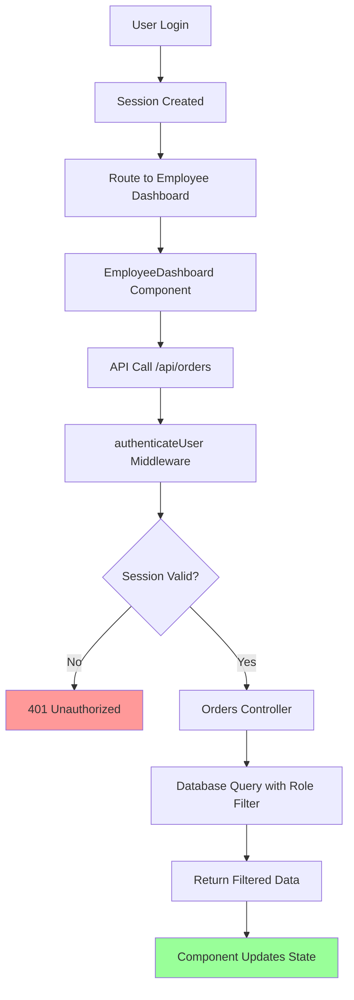

# Fix Employee Dashboard Pages Loading Issues

## Overview

This design document addresses the critical issue where employee dashboard, orders, and inventory pages are showing blank content instead of loading actual data. Based on the codebase analysis and USERREAD.md documentation, the problem stems from authentication middleware and session management inconsistencies between the frontend components and backend API endpoints.

## Architecture

### Current System Flow


### Problem Areas Identified

#### 1. Session Management Inconsistencies
- Frontend components expect session-based authentication
- Backend middleware `authenticateUser` expects `req.session.userId`
- Session creation and validation may be failing

#### 2. Role-Based Data Filtering
- Backend correctly filters data by user role and merchant_id
- Non-admin users should only see assigned orders
- Empty results may indicate no data assignment rather than API failure

#### 3. Authentication Flow Issues
- Middleware chain: `authenticateUser` → Route handlers
- Session validation in `backend/middleware/auth.ts`
- Cache implementation may be interfering with user data retrieval

## Component Analysis

### EmployeeDashboard.tsx Issues
- **API Call**: Uses `/api/orders` endpoint correctly
- **Data Processing**: Expects `data.orders` array format
- **Authentication**: Uses `credentials: 'include'` for session cookies
- **Problem**: Loading state shows but data never populates

### EmployeeOrders.tsx Issues  
- **API Call**: Uses same `/api/orders` endpoint as dashboard
- **Data Filtering**: Implements client-side filtering correctly
- **Status Updates**: Uses `/api/employee/orders/:id/status` endpoint
- **Problem**: Empty state message shows instead of actual orders

### EmployeeInventory.tsx Issues
- **API Call**: Uses `/api/inventory` endpoint 
- **Data Processing**: Expects `data.products` array format
- **Summary Cards**: Calculates metrics from product data
- **Problem**: Loading completes but no products display

## Root Cause Analysis

### 1. Authentication Middleware Chain
The `authenticateUser` middleware in `backend/middleware/auth.ts`:
```typescript
export async function authenticateUser(req: Request, res: Response, next: NextFunction) {
  const userId = (req as any).session?.userId;
  if (!userId) {
    return res.status(401).json({ message: 'Authentication required' });
  }
  // ... user lookup and caching
}
```

**Potential Issues**:
- Session cookie not being sent properly from frontend
- Session userId not matching database user_id format (string vs integer)
- Cache implementation returning stale/invalid data for user 10000004

### 2. Database Query Role Filtering
Backend orders endpoint uses role-based filtering:
```typescript
// If user is not admin, only show their assigned orders  
if (role !== 'admin') {
  query += ` AND o.user_id = $${paramIndex}`;
  params.push((req as any).session.userId);
  paramIndex++;
}
```

**Specific Issue Analysis**:
- User `mya` (ID: 10000004) has role "Pickup" (non-admin)
- Order 31 is assigned to user_id 10000004
- Query should return order 31 when session.userId = '10000004' or 10000004
- **Likely Issue**: Session userId type mismatch (string '10000004' vs integer 10000004)

### 3. Frontend-Backend Data Contract
Frontend expects:
```typescript
// EmployeeDashboard expects:
const data = await response.json();
if (data.orders && Array.isArray(data.orders)) {
  // Process orders
}

// EmployeeInventory expects:
const data = await response.json();  
if (data.products && Array.isArray(data.products)) {
  // Process products
}
```

Backend returns:
```typescript
// Orders endpoint returns:
res.json({
  orders: result.rows,
  pagination: { ... }
});

// Inventory endpoint returns:
res.json({
  products: result.rows,
  pagination: { ... }
});
```

## Solution Implementation

### 1. Session Debugging and Validation

#### Add Session Debugging Middleware
```typescript
// Add to backend/routes.ts
app.use('/api', (req, res, next) => {
  logger.info('API Request Debug', {
    path: req.path,
    method: req.method,
    sessionId: req.sessionID,
    userId: (req as any).session?.userId,
    hasSession: !!(req as any).session,
    cookies: req.headers.cookie
  });
  next();
});
```

#### Enhanced Error Handling
```typescript
// Update authenticateUser middleware
export async function authenticateUser(req: Request, res: Response, next: NextFunction) {
  try {
    const userId = (req as any).session?.userId;
    
    if (!userId) {
      logger.error('Authentication failed - no userId in session', {
        sessionExists: !!(req as any).session,
        sessionId: req.sessionID,
        path: req.path
      });
      return res.status(401).json({ 
        message: 'Authentication required',
        debug: process.env.NODE_ENV === 'development' ? {
          sessionExists: !!(req as any).session,
          sessionId: req.sessionID
        } : undefined
      });
    }
    
    // ... rest of middleware
  } catch (error) {
    logger.error('Authentication middleware error', {
      error: error instanceof Error ? error.message : String(error),
      path: req.path,
      userId: (req as any).session?.userId
    });
    res.status(500).json({ message: 'Authentication error' });
  }
}
```

### 2. Data Assignment Verification and Debug Endpoints

#### Real Data Analysis
Based on the provided database data:
- **User**: `mya` (ID: 10000004) with role "Pickup" 
- **Assigned Order**: Order ID 31 assigned to user 10000004
- **Order Status**: "delivered" with total amount 692.00

This confirms that:
1. User `mya` exists and has role "Pickup" (non-admin)
2. Order 31 is properly assigned to user 10000004 (mya)
3. The assignment mechanism is working at database level

#### Add Debug Endpoint for Development
```typescript
// Add to backend/orders.ts (existing debug endpoint enhancement)
if (process.env.NODE_ENV === 'development') {
  router.get('/debug', async (req: Request, res: Response) => {
    const client = await pool.connect();
    try {
      const userResult = await client.query(
        'SELECT merchant_id, role, username FROM oms.users WHERE user_id = $1',
        [(req as any).session.userId]
      );
      
      if (userResult.rows.length === 0) {
        return res.status(401).json({ message: 'User not found' });
      }
      
      const { merchant_id: merchantId, role, username } = userResult.rows[0];
      
      // Enhanced debug information
      const [ordersCount, assignedCount, usersCount, productsCount, specificAssignedOrders] = await Promise.all([
        client.query('SELECT COUNT(*) as total FROM oms.orders WHERE merchant_id = $1', [merchantId]),
        client.query('SELECT COUNT(*) as assigned FROM oms.orders WHERE merchant_id = $1 AND user_id = $2', [merchantId, (req as any).session.userId]),
        client.query('SELECT user_id, username, role FROM oms.users WHERE merchant_id = $1', [merchantId]),
        client.query('SELECT COUNT(*) as total FROM oms.products WHERE merchant_id = $1', [merchantId]),
        client.query('SELECT order_id, customer_name, status, total_amount, created_at FROM oms.orders o LEFT JOIN oms.customers c ON o.customer_id = c.customer_id WHERE o.merchant_id = $1 AND o.user_id = $2', [merchantId, (req as any).session.userId])
      ]);
      
      res.json({
        user: { role, merchantId, userId: (req as any).session.userId, username },
        data: {
          totalOrders: ordersCount.rows[0].total,
          assignedOrders: assignedCount.rows[0].assigned,
          totalProducts: productsCount.rows[0].total
        },
        assignedOrderDetails: specificAssignedOrders.rows,
        allUsers: usersCount.rows,
        sessionInfo: {
          sessionId: req.sessionID,
          hasSession: !!(req as any).session
        }
      });
    } catch (error) {
      logger.error('Debug endpoint error', error instanceof Error ? error.message : String(error));
      res.status(500).json({ message: 'Debug failed', error: error instanceof Error ? error.message : String(error) });
    } finally {
      client.release();
    }
  });
}
```

#### Verify Existing Data Integrity
```typescript
// Add verification endpoint to backend/routes.ts
app.get('/api/debug/verify-user-data', async (req: Request, res: Response) => {
  if (process.env.NODE_ENV !== 'development') {
    return res.status(404).json({ message: 'Not found' });
  }
  
  const client = await pool.connect();
  try {
    // Check for specific user 'mya' and their assignments
    const mayaUser = await client.query(
      'SELECT user_id, merchant_id, username, role FROM oms.users WHERE username = $1',
      ['mya']
    );
    
    if (mayaUser.rows.length === 0) {
      return res.json({ message: 'User mya not found' });
    }
    
    const mayaId = mayaUser.rows[0].user_id;
    const merchantId = mayaUser.rows[0].merchant_id;
    
    // Get mya's assigned orders
    const mayaOrders = await client.query(
      'SELECT o.order_id, o.order_source, o.total_amount, o.status, o.created_at, c.name as customer_name FROM oms.orders o LEFT JOIN oms.customers c ON o.customer_id = c.customer_id WHERE o.user_id = $1',
      [mayaId]
    );
    
    // Check current session user
    const currentUserId = (req as any).session?.userId;
    const isCurrentUserMaya = currentUserId && parseInt(currentUserId) === mayaId;
    
    res.json({
      mayaUser: mayaUser.rows[0],
      mayaOrders: mayaOrders.rows,
      currentSessionUserId: currentUserId,
      isCurrentUserMaya,
      sessionExists: !!(req as any).session
    });
  } catch (error) {
    logger.error('Error verifying user data', error instanceof Error ? error.message : String(error));
    res.status(500).json({ message: 'Failed to verify user data' });
  } finally {
    client.release();
  }
});
```

### 3. Frontend Error Handling Enhancement

#### Enhanced Error Display in Components
```typescript
// Update EmployeeDashboard.tsx
const loadAssignedOrders = async () => {
  try {
    console.log('Loading assigned orders for employee dashboard');
    const response = await fetch('/api/orders', {
      credentials: 'include'
    });
    
    console.log('Employee dashboard API response:', {
      status: response.status,
      ok: response.ok,
      headers: Object.fromEntries(response.headers.entries())
    });
    
    if (!response.ok) {
      const errorData = await response.text();
      console.error('API Error:', response.status, errorData);
      throw new Error(`API Error: ${response.status} - ${errorData}`);
    }
    
    const data = await response.json();
    console.log('Employee dashboard data:', data);
    
    if (data.orders && Array.isArray(data.orders)) {
      const formattedOrders = data.orders.map((order: any) => ({
        order_id: order.order_id.toString(),
        order_number: `ORD${order.order_id}`,
        customer_name: order.customer_name || 'Unknown',
        customer_phone: order.customer_phone || 'N/A',
        delivery_address: order.customer_address || 'N/A',
        total_amount: parseFloat(order.total_amount) || 0,
        status: order.status || 'pending',
        assigned_at: order.created_at || new Date().toISOString()
      }));
      setAssignedOrders(formattedOrders);
      calculateStats(formattedOrders);
    } else {
      console.warn('No orders array in response:', data);
      setAssignedOrders([]);
      calculateStats([]);
    }
  } catch (error) {
    console.error('Failed to load assigned orders:', error);
    setAssignedOrders([]);
    calculateStats([]);
  } finally {
    setLoading(false);
  }
};
```

#### Add Debug Panel for Development
```typescript
// Add to EmployeeDashboard.tsx
const [debugInfo, setDebugInfo] = useState<any>(null);
const [showDebug, setShowDebug] = useState(process.env.NODE_ENV === 'development');

const loadDebugInfo = async () => {
  try {
    const response = await fetch('/api/orders/debug', {
      credentials: 'include'
    });
    if (response.ok) {
      const data = await response.json();
      setDebugInfo(data);
    }
  } catch (error) {
    console.error('Debug info load failed:', error);
  }
};

// In useEffect
useEffect(() => {
  loadAssignedOrders();
  if (showDebug) {
    loadDebugInfo();
  }
}, []);

// Add debug panel to component render
{showDebug && debugInfo && (
  <div className="bg-yellow-100 dark:bg-yellow-900 p-4 rounded-lg mb-6">
    <h3 className="font-bold">Debug Information</h3>
    <pre className="text-xs">{JSON.stringify(debugInfo, null, 2)}</pre>
    <button 
      onClick={loadDebugInfo}
      className="mt-2 px-3 py-1 bg-blue-500 text-white rounded text-sm"
    >
      Refresh Debug Info
    </button>
  </div>
)}
```

### 4. Backend Endpoint Enhancements

#### Improved Error Responses
```typescript
// Update orders endpoint error handling
router.get('/', validatePagination, cacheMiddleware(30), async (req: Request, res: Response) => {
  const client = await pool.connect();
  try {
    
    const result = await client.query(query, params);
    
    // Enhanced response with debug info
    const response = {
      orders: result.rows,
      pagination: {
        page: Number(page),
        limit: limitNum,
        total: result.rows[0]?.total_count || 0,
        totalPages: Math.ceil((result.rows[0]?.total_count || 0) / limitNum)
      }
    };
    
    if (process.env.NODE_ENV === 'development') {
      response.debug = {
        queryParams: { page, limit, status, channel, search },
        userRole: role,
        merchantId,
        userId: (req as any).session.userId,
        queryExecuted: query.replace(/\s+/g, ' '),
        queryParams: params
      };
    }
    
    res.json(response);
  } catch (error) {
    logger.error('Error fetching orders', {
      error: error instanceof Error ? error.message : String(error),
      userId: (req as any).session.userId,
      query: req.query
    });
    res.status(500).json({ 
      message: 'Failed to fetch orders',
      debug: process.env.NODE_ENV === 'development' ? {
        error: error instanceof Error ? error.message : String(error)
      } : undefined
    });
  } finally {
    client.release();
  }
});
```

## Testing Strategy

### 1. Session Validation Testing
- Verify session creation during login
- Check session persistence across page refreshes
- Validate session data structure and content

### 2. API Endpoint Testing
- Test `/api/orders` endpoint directly via browser dev tools
- Verify response format matches frontend expectations
- Check authentication headers and cookies

### 3. Role-Based Data Testing
- Create test employee user accounts
- Assign test orders to employee users
- Verify data filtering works correctly

### 4. Frontend Component Testing
- Add console logging to track data flow
- Test loading states and error conditions
- Verify state updates and re-renders

## Implementation Plan

### Phase 1: Debugging Infrastructure
1. Add enhanced logging to authentication middleware
2. Create debug endpoints for development
3. Implement frontend error handling improvements
4. Add debug panels to employee components

### Phase 2: Data Verification
1. Verify existing user 'mya' session authentication
2. Confirm role-based filtering works correctly with real data
3. Validate that assigned order (ID: 31) appears in employee dashboard
4. Test end-to-end data flow with actual assigned orders

### Phase 3: Production Fixes
1. Remove debug code and logging
2. Implement proper error handling
3. Optimize database queries
4. Add monitoring and alerting

## Validation Criteria

### Success Metrics
- Employee dashboard loads with assigned orders
- Employee orders page shows filtered data
- Employee inventory page displays all merchant products
- No 401/403 authentication errors
- Proper loading states and error handling

### Test Cases
1. **User 'mya' Login → Dashboard**: Should show order ID 31 (delivered, 692.00) in assigned orders list
2. **Employee Orders Page**: Should display order ID 31 with proper customer details and delivered status
3. **Employee Inventory Page**: Should show read-only view of all merchant inventory
4. **Admin vs Employee**: Different data sets based on role (admin sees all orders, mya sees only order 31)
5. **Session Validation**: Verify user ID 10000004 is properly stored and retrieved from session

## Risk Mitigation

### Development Safety
- All debug endpoints restricted to development environment
- Debug information excluded from production builds
- Proper error handling prevents data exposure

### Data Security
- Session-based authentication maintained
- Role-based access control preserved  
- Merchant data isolation enforced

### Performance Impact
- Debug logging only in development
- Efficient database queries maintained
- Proper connection management preserved